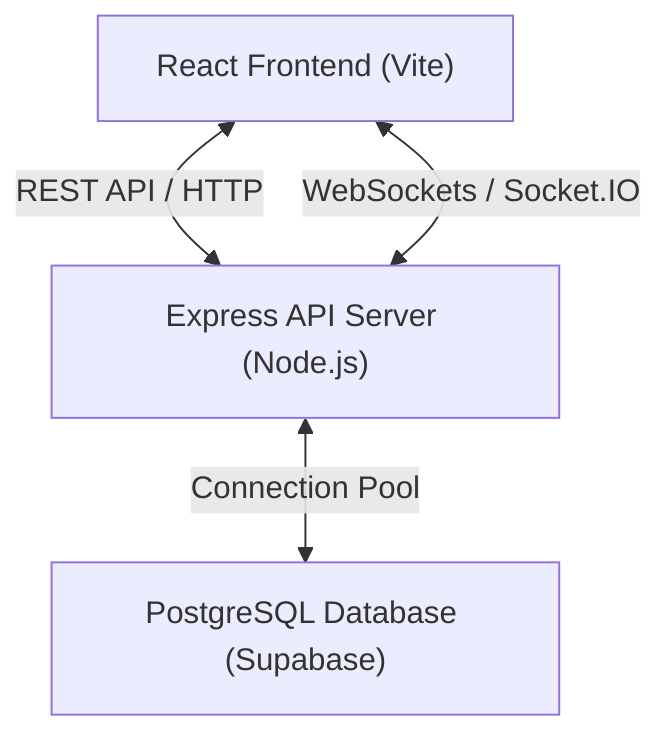
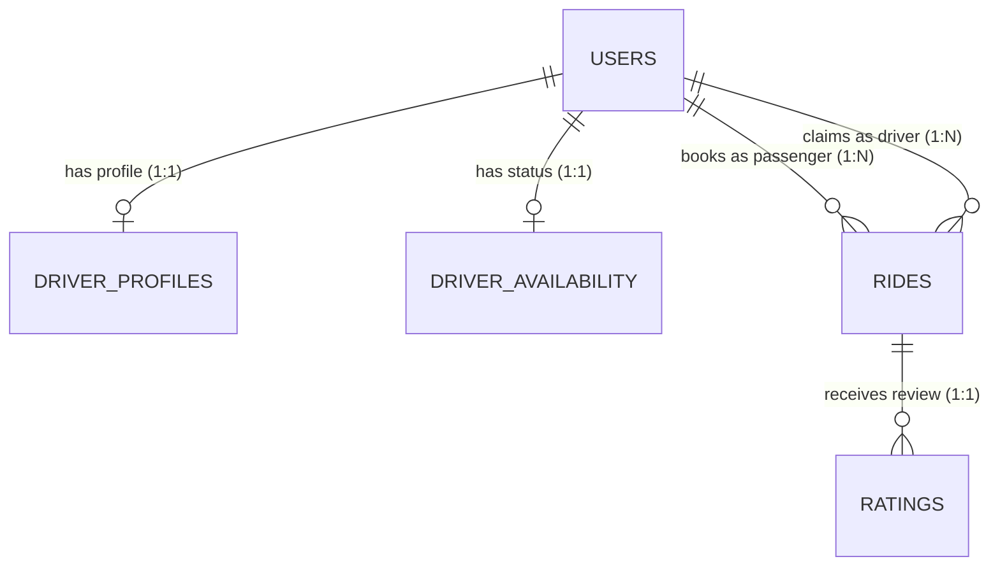

# IITR EcoRide — Design Document 📝

---

## 1. Problem Understanding

Moving across the vast IIT Roorkee campus (e.g., from hostels like Rajendra Bhawan to lecture complex LHC or the Main Gate) presents unique mobility challenges:
* **Inefficient Booking & Queueing**: Students wait indefinitely at campus gates or main hubs without knowing e-rickshaw availability.
* **Fare Inconsistencies**: Lack of a standardized pricing mechanism leading to fare negotiation friction.
* **Driver Idle Time**: Drivers cluster in random zones, leading to supply-demand mismatch, especially during peak class hours or library study sessions.

**System Goal**: IITR EcoRide bridges this gap by offering a real-time, WebSockets-synchronized booking and bidding platform. It provides passengers with instant booking and proportional pricing, and equips drivers with historical/live AI forecasting to identify hotspots.

---

## 2. System Architecture

The application is built on a decoupled Client-Server architecture designed to run on lightweight, cost-effective hosting instances:



### Key Components:
1. **Frontend Client (React + Vite)**: A responsive single-page application styled using vanilla CSS. Uses `Socket.io-client` for real-time sync.
2. **Backend Server (Node.js + Express)**: Serves REST APIs and manages live WebSocket rooms (`drivers`, user-specific rooms).
3. **Database (PostgreSQL via Supabase)**: Retains relational data (Users, Rides, Driver Profiles, Availability) with transaction safety.

---

## 3. Database Schema

Here is the data structure configured in our PostgreSQL instance:

```sql
-- 1. Users Table
CREATE TABLE users (
  id            UUID PRIMARY KEY DEFAULT gen_random_uuid(),
  full_name     VARCHAR(120) NOT NULL,
  email         VARCHAR(255) NOT NULL UNIQUE,
  password_hash VARCHAR(255) NOT NULL,
  phone         VARCHAR(20),
  role          VARCHAR(10) NOT NULL DEFAULT 'rider' CHECK (role IN ('rider', 'driver', 'admin')),
  created_at    TIMESTAMPTZ NOT NULL DEFAULT NOW(),
  updated_at    TIMESTAMPTZ NOT NULL DEFAULT NOW()
);

-- 2. Driver Profiles
CREATE TABLE driver_profiles (
  driver_id       UUID PRIMARY KEY REFERENCES users(id) ON DELETE CASCADE,
  vehicle_model   VARCHAR(255) NOT NULL,
  license_plate   VARCHAR(100) NOT NULL,
  total_rides     INT DEFAULT 0,
  total_ratings   INT DEFAULT 0,
  average_rating  NUMERIC(3,1) DEFAULT 0.0,
  created_at      TIMESTAMPTZ NOT NULL DEFAULT NOW(),
  updated_at      TIMESTAMPTZ NOT NULL DEFAULT NOW()
);

-- 3. Driver Availability
CREATE TABLE driver_availability (
  id            UUID PRIMARY KEY DEFAULT gen_random_uuid(),
  driver_id     UUID UNIQUE REFERENCES users(id) ON DELETE CASCADE,
  is_available  BOOLEAN NOT NULL DEFAULT false,
  current_lat   DOUBLE PRECISION,
  current_lng   DOUBLE PRECISION,
  heading       VARCHAR(255),
  updated_at    TIMESTAMPTZ NOT NULL DEFAULT NOW()
);

-- 4. Rides Table
CREATE TABLE rides (
  id              UUID PRIMARY KEY DEFAULT gen_random_uuid(),
  rider_id        UUID REFERENCES users(id) ON DELETE CASCADE,
  driver_id       UUID REFERENCES users(id) ON DELETE SET NULL,
  pickup_location VARCHAR(255) NOT NULL,
  pickup_lat      DOUBLE PRECISION,
  pickup_lng      DOUBLE PRECISION,
  dropoff_location VARCHAR(255) NOT NULL,
  dropoff_lat     DOUBLE PRECISION,
  dropoff_lng     DOUBLE PRECISION,
  status          VARCHAR(20) NOT NULL DEFAULT 'requested' 
                  CHECK (status IN ('requested', 'accepted', 'in_progress', 'completed', 'cancelled')),
  base_fare       NUMERIC(6,2) DEFAULT 10.00,
  tip             NUMERIC(6,2) DEFAULT 0.00,
  passenger_count INT DEFAULT 1,
  is_scheduled    BOOLEAN DEFAULT false,
  scheduled_for   TIMESTAMPTZ,
  requested_at    TIMESTAMPTZ NOT NULL DEFAULT NOW(),
  accepted_at     TIMESTAMPTZ,
  completed_at    TIMESTAMPTZ
);

-- 5. Ratings Table
CREATE TABLE ratings (
  id            SERIAL PRIMARY KEY,
  ride_id       UUID REFERENCES rides(id) ON DELETE CASCADE,
  passenger_id  UUID REFERENCES users(id) ON DELETE CASCADE,
  driver_id     UUID REFERENCES users(id) ON DELETE CASCADE,
  rating        INT CHECK (rating >= 1 AND rating <= 5),
  feedback_text TEXT
);
```

---

## 4. Entity Relationship Diagram (ERD)



---

## 5. API Overview

### Authentication `/api/auth`
* `POST /register`: Create passenger/driver credentials.
* `POST /login`: Generate authentication JSON Web Token.
* `GET /profile`: Fetch comprehensive profile details (includes driver vehicle stats).
* `PUT /profile`: Update profile fields (phone, vehicle model, license plate).

### Driver Availability `/api/drivers`
* `PUT /availability`: Toggle driver online/offline status and update lat/lng coordinates.
* `GET /available`: List all available online drivers for map display.

### Ride Actions `/api/rides`
* `POST /`: Request a new ride with custom fare, passenger count, and optional schedule parameters.
* `GET /`: Retrieve passenger or driver ride history.
* `PATCH /:id/accept`: Claim an open request.
* `PATCH /:id/status`: Update ride status (Accepted → In Progress → Completed).
* `POST /rate`: Submit passenger rating and feedback text.

### Demand Forecasting `/api/forecasting`
* `GET /hotspots`: Return time-series prediction analysis for campus locations.

---

## 6. Design Decisions & Unique Features

We implemented the mandatory requirements while building several **extra features** to improve usability and reliability:

### A. AI Demand Forecasting (Option A chosen)
* **Design Decision**: Instead of hosting a resource-heavy Python Flask server, forecasting is calculated directly inside Node.js. It pulls historical ride patterns ($60\%$ weight) and merges them with recent 2-hour trends ($40\%$ weight). 
* **Value**: Low overhead, fast processing, and high accuracy for cyclical campus patterns.

### B. Proportional Passenger Fare Scaling
* **New Feature**: Added a passenger count selector. Fares automatically scale (e.g. ₹10 base rate * $n$ passengers) so group riders pay fairly and drivers maximize trip earnings.

### C. Live Real-Time Ride Synchronization
* **New Feature**: When a driver accepts a ride request, the backend immediately emits a `ride_taken` Socket.io event to all other drivers. This instantly clears the claimed request from all other drivers' screens, eliminating concurrent conflicts.

### D. Contextual Quick Chat Replies
* **New Feature**: Live chat contains scrollable contextual pills (e.g., *"I've arrived"*, *"I'm coming"*) allowing passengers and drivers to communicate coordinates instantly on the move.

### E. Proactive Scheduled Ride Alerts
* **New Feature**: Drivers get a proactive browser notification 15 minutes before their scheduled bookings start, ensuring prompt pickups.
